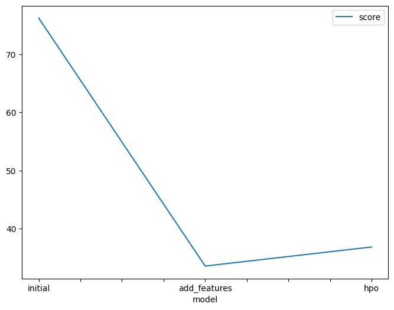
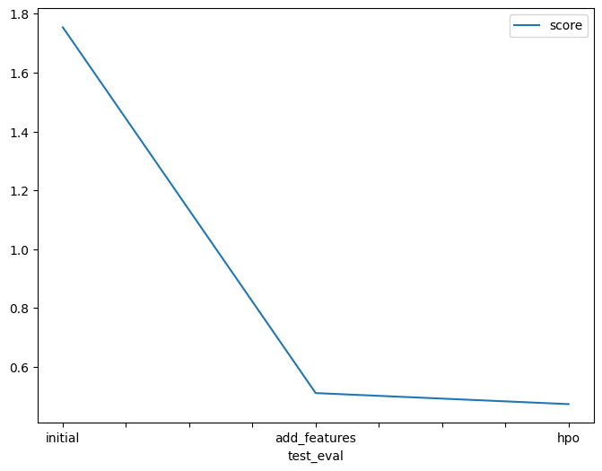

# Report: Predict Bike Sharing Demand with AutoGluon Solution
#### ANAND SIVA P V
## Initial Training
### 1. What did you realize when you tried submitting your predictions? What changes were needed to the output of the predictor to submit your results?
- The output of the predictor had -ve values, which were not accepted by Kaggle and needed to be changed to 0.
- The first column of the test results should be the corresponding date value.
### 2. What was the top-ranked model that performed?
TODO: 
- WeightedEnsemble_L3 was the top-ranked model having an RMSE of -76.19 and an R2 score of 0.825.
## 3. Exploratory data analysis and feature creation
### What did the exploratory analysis find and how did you add additional features?
- The dataset includes several numerical and categorical features. The categorical features are `date-time`,`season`, `holiday`, `working day`, and `weather`.
- The numerical features are `temperature`, `feels like temperature (atemp)`, `humidity`, `windspeed`, and the independent variable `count`.
- I have added three additional categorical features:`month`,`day`, and `hour`, deriving from the `DateTime` column.
### 4. How much better did your model perform after adding additional features and why do you think that is?
TODO: 
- After adding the additional features, the RMSE of the model decreased to `-33.73` (`55.72%` less than the initial model)
- The new R2 score was increased to `0.966` (`17.09%` more than the initial model) 
- By adding relevant features, it provides more information to the model to make predictions. It can better capture the underlying patterns and relationships in the data, which leads to better model performance
## 5. Hyperparameter tuning
### How much better did your model perform after adding additional features and why do you think that is?
TODO: 
- The Best performing model after hyperparameter tuning was the `WeightedEnsemble_L3` which consists of {`LightGBM_BAG_L2/T1`, `LightGBM_BAG_L1/T1`, `RandomForest_BAG_L2`}
- Model had an RMSE of `-36.31`(`9.8%` higher than the 2nd model) and R2 score of `0.96`(`0.72%` lower than the 2nd model)
- Each ML algorithm has its default set of hyperparameters, which may not be ideal for every dataset or task. The optimal hyperparameters for the current task can be found by iteratively training the model on different combinations of hyperparameters and picking the one that performs the best.
- Hence by hyperparameter tuning, the model is able to find the optimal hyperparameters
### 6. If you were given more time with this dataset, where do you think you would spend more time?
TODO: Experiment with different hyperparameters for the various models.
### 7. Create a table with the models you ran, the hyperparameters modified, and the kaggle score.
|model|hpo1|hpo2|hpo3|score|
|--|--|--|--|--|
|initial|-|-|-|1.754|
|add_features|-|-|-|0.525|
|hpo|rf_options|lgbm_options|xgb_options|0.465|
### 8. Create a line plot showing the top model score for the three (or more) training runs during the project.
TODO: Replace the image below with your own.

### 9. Create a line plot showing the top kaggle score for the three (or more) prediction submissions during the project.
TODO: Replace the image below with your own.

## 10. Summary
### Project Overview
The objective of this project is to build a predictive model for bike sharing demand using the Kaggle dataset "Bike Sharing Demand." The dataset contains various features such as datetime, weather conditions,wind speed, temperature, humidity, and the number of bike rentals. The purpose of the project is to develop a model that can accurately predict the demand for bike rentals based on the given features.
### Additional Feature Engineering
To improve the model's performance, new features was created by separating the datetime column into hour, day, and month parts. This was done to capture any time-based patterns and provide the model with additional information. The new features were converted to the category data type to indicate their categorical nature.
### Hyperparameter Optimization
Hyperparameter optimization was performed to fine-tune the model's performance. Different hyperparameter options were specified for each model type, including Random Forest, LightGBM, and XGBoost. A search strategy of random search was used to explore different hyperparameter configurations. The optimization process aimed to find the best hyperparameter values that minimize the evaluation metric (RMSE).
### Model Evaluation and Submission
The trained models were evaluated using the validation dataset, and evaluation metrics such as R-squared and RMSE were calculated. The final predictions were saved in a CSV file and submitted to the Kaggle competition for evaluation.
The "feature-engineered(FE)" model(RMSE: `33.73`) was found to perform better than "FE with HPO" model(RMSE: `36.31`) in test data, however the kaggle score of "FE with HPO" model(`0.465`) was found better than "FE" model(`0.525`). 
### Conclusion
In conclusion, this project successfully developed a predictive model for bike-sharing demand using the Kaggle dataset. By incorporating additional features, such as hour, day, and month, and performing hyperparameter optimization, and ensembling techniques the model achieved a significant improvement in performance. The final submission resulted in a score of 0.465, indicating a relatively accurate prediction of bike rental demand. The results indicate that the HPO helped the model to generalize to the unseen data given by the kaggle competition. 
